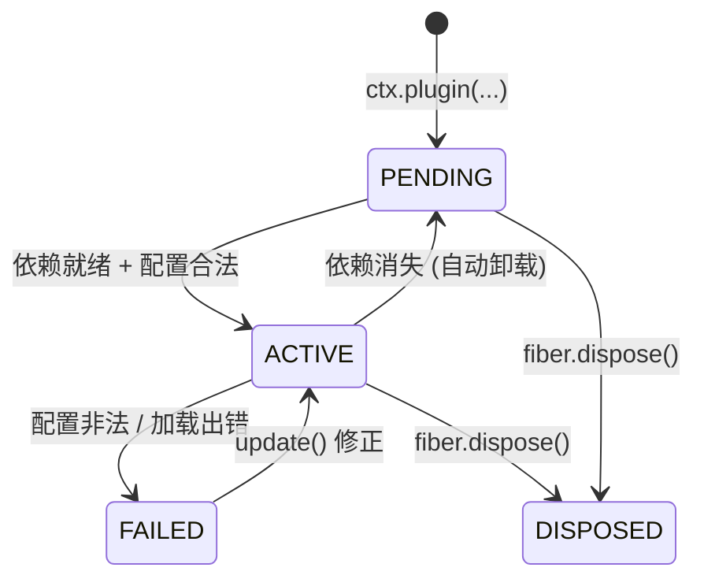

# cordis-port

[](https://pypi.org/project/cordis-port/)
[](LICENSE)
[](https://www.python.org/downloads/)
[](#安装)
[](https://github.com/fshoocn/cordis-port/actions/workflows/ci.yml)

[cordis](https://github.com/cordiverse/cordis) 核心包（`packages/core`）的 **Python 移植**：
一套轻量的**插件化运行时**，提供依赖注入、事件总线与自动生命周期管理。

- 纯标准库实现，**零第三方依赖**
- 需要 **Python 3.12+**（使用了 PEP 695 泛型语法）
- 完整中文注释，各模块文件头可直接当作文档阅读
- 已标注 `py.typed`，mypy / pyright / Pylance 可直接获得类型提示

> **关键词**：插件框架 · 依赖注入容器 · IoC 容器 · 服务容器 · 事件总线 · 异步运行时 ·
> 依赖驱动的生命周期管理 · cordis 移植
> —— plugin framework, DI container, IoC container, service container, event bus,
> async runtime, cordis port

## 移植基线

本库对齐的上游版本如下，移植层的 API 语义均以该基线的 TypeScript 源码为准：

| 项目 | 值 |
| --- | --- |
| 上游仓库 | [cordiverse/cordis](https://github.com/cordiverse/cordis) |
| 目标包 | `packages/core`（npm 包名 `cordis`） |
| 分支 | `main` |
| 提交 | [`f8ea3cd50f1a5724e8e715995bcde131c9c12b2c`](https://github.com/cordiverse/cordis/commit/f8ea3cd50f1a5724e8e715995bcde131c9c12b2c)（短号 `f8ea3cd`） |
| 提交时间 | 2026-09-08 23:39:20 +0800 |
| 提交说明 | `chore: bump versions` |
| 上游版本号 | `4.0.0-rc.10` |
| 文档更新时间 | 2026-09-17 |

> 移植基线已逐文件校验：本地 `packages/core/src/*.ts` 参考副本与该提交的 9 个源文件
> 逐字节一致（SHA-256 完全匹配）。

---

## 安装

### 在线安装

**方式一：从 PyPI 安装（推荐）**

```powershell
pip install cordis-port
```

**方式二：从 GitHub 直接安装**（始终取最新代码）

```powershell
pip install "git+https://github.com/fshoocn/cordis-port.git"
```

锁定到某个标签或提交：

```powershell
# 指定标签
pip install "git+https://github.com/fshoocn/cordis-port.git@v0.1.1"

# 指定提交
pip install "git+https://github.com/fshoocn/cordis-port.git@8fbc905"
```

两种方式导入名都是 `cordis_port`：

```python
from cordis_port import Context
```

### 本地安装

**方式一：克隆到项目内（推荐用于参与开发）**

```powershell
git clone https://github.com/fshoocn/cordis-port.git cordis_port
```

> **关键要求是包目录必须命名为 `cordis_port`**（否则 `import cordis_port` 无法生效）。
> 若克隆时未指定目录名，需手动重命名：

```powershell
git clone https://github.com/fshoocn/cordis-port.git
Rename-Item cordis-port cordis_port
```

之后在 `cordis_port/` 的**父目录**运行代码，即可 `import cordis_port`。

**方式二：从本地目录安装**

```powershell
# 可编辑模式：改动源码立即生效，适合开发
pip install -e path/to/cordis-port

# 普通安装
pip install path/to/cordis-port
```
**方式三：加入 `sys.path`**

```python
import sys
sys.path.insert(0, r"path/to/cordis-port-parent")   # 含 cordis_port/ 目录的那一级
from cordis_port import Context
```

**从源码构建（可选）**

```powershell
pip install build
python -m build          # 产物在 dist/
```

**自检**

```powershell
# 语法检查（在仓库根目录运行）
python -c "import ast, pathlib; [ast.parse(f.read_text(encoding='utf-8')) for f in pathlib.Path('.').glob('*.py')]; print('OK')"

# 导出表检查（在仓库的父目录运行）
python -c "import cordis_port; print(len(cordis_port.__all__), 'exports')"
```

> 本项目要求包目录名为 `cordis_port`，仓库根目录即为包目录。
> `pyproject.toml` 已通过 `package-dir` 映射处理了该布局，
> 因此 pip（无论从网络还是本地）安装时都能正确识别包名。

---

## 简介

核心思想：

> 应用由许多**插件**组成，插件之间不直接引用，而是通过**服务**与**事件**通信；
> 框架负责按依赖关系自动加载/卸载插件，并在插件退出时清理其产生的所有副作用。

### 四个核心概念

| 概念 | 类型 | 职责 |
| --- | --- | --- |
| **上下文** | `Context` | 插件看到的「全局门面」：`ctx.xxx` 访问服务，`ctx.on()` 监听事件，`ctx.plugin()` 加载子插件 |
| **纤程** | `Fiber` | 一次插件加载的生命周期载体：管理副作用、响应依赖变化、隔离错误 |
| **服务** | `Service` | 可被其他插件依赖的能力单元（数据库连接、日志、配置……） |
| **副作用** | effect | 插件产生的任何需要清理的东西（监听器、定时器、服务注册），随 fiber 卸载自动回收 |

### 依赖驱动的状态流转



关键特性：**插件无需手动监听依赖变化**。当某个服务被注册，依赖它的插件自动激活；
当该服务被注销，依赖它的插件自动卸载。这一机制由 `Fiber` 的「纪元（epoch）」比对驱动。

---

## 快速开始

### 1. 最小插件

插件可以是**类**或**函数**。类插件会依次执行 `__init__(ctx, config)` → `init()`：

```python
import asyncio
from cordis_port import Context

class Greeter:
    def __init__(self, ctx, config):
        self.ctx = ctx
        self.config = config

    def init(self):
        self.ctx.logger.info("greeter ready: %o", self.config)

async def main():
    ctx = Context()
    fiber = ctx.plugin(Greeter, {"hello": "world"})   # 返回 Fiber（可 await）
    await fiber                                       # 等待加载完成
    print(fiber.get_state().name)                     # ACTIVE

asyncio.run(main())
```

### 2. 定义服务

继承 `Service` 并声明 `provide`（服务名）；构造即注册：

```python
from cordis_port import Service

class Counter(Service):
    provide = "counter"

    def __init__(self, ctx):
        super().__init__(ctx)
        self.n = 0

    def inc(self):
        self.n += 1
        return self.n
```

在其他插件中注册它，之后即可通过 `ctx.counter` 全局访问：

```python
class Provider:
    def __init__(self, ctx, config):
        self.ctx = ctx

    def init(self):
        Counter(self.ctx)          # 生命周期跟随当前 fiber

await ctx.plugin(Provider)
ctx.counter.inc()                  # 1
```

> 服务名在同一隔离层内必须唯一，重复注册会抛出 `RuntimeError`。

### 3. 声明依赖

三种写法等价，推荐按需选择：

```python
# (a) 列表形式：只声明名字
class A:
    inject = ["counter"]

    def __init__(self, ctx, config):
        self.ctx = ctx

# (b) 字典形式：可携带依赖配置（写入拦截层供服务读取）
class B:
    inject = {"counter": {"opt": 1}}

    def __init__(self, ctx, config):
        self.ctx = ctx

# (c) 装饰器形式：依赖就绪后自动调用被装饰方法
from cordis_port import Inject

class C(Service):
    provide = "consumer"

    @Inject("counter")
    def use_counter(self):
        print(self.ctx.counter.n)      # 依赖就绪后被调用
        return lambda: print("bye")    # 返回值可作为清理函数（见下方说明）
```

依赖满足前 fiber 停留在 `PENDING`；服务出现后自动切换为 `ACTIVE`。

> **关于 `@Inject` 方法装饰器**（与上游设计一致）
>
> 装饰器会发现宿主实例上的 `Tracker.property` 来决定把注入的上下文绑定到哪个属性。
> `Service` 基类会自动安装 `Tracker(property="ctx", associate=服务名)`，因此**推荐用于
> `Service` 子类**（上游 `packages/core/tests/decorator.spec.ts` 也正是这样测试的）：
> 方法体内的 `self.ctx` 会被替换为「声明了该依赖的子插件上下文」，从而可以直接访问依赖。
>
> 普通插件类没有 Tracker，`property` 为空，此时方法虽仍会在依赖就绪后被调用，
> 但 `self.ctx` 不会被替换（与上游 `property ? withProps(this, ...) : this` 的分支一致）。
> 因此这类插件请改用 (a) / (b) 两种声明方式。
>
> **两个行为细节**：
> 1. 被装饰方法的**返回值会被当作 effect 处理** —— 返回可调用对象即注册为清理函数，
>    在依赖卸载时被调用（上游测试正是用这一点验证生命周期）；
> 2. 方法调用经「内部子插件」异步加载，相对父插件存在一个延迟；若需等待其执行完毕，
>    可在加载后 `await asyncio.sleep(0)` 让出一轮事件循环。

### 4. 事件

支持五种派发模式：

```python
# emit：同步通知所有人，忽略返回值
ctx.on("greet", lambda name: print("hi", name))
ctx.emit("greet", "world")

# serial / bail：依次调用，遇到第一个有效返回值就停下
ctx.on("pick", lambda: None)
ctx.on("pick", lambda: "first")
print(await ctx.serial("pick"))    # "first"
print(ctx.bail("pick"))            # "first"（同步版）

# parallel：并发执行，失败汇总为 EventDispatchError
await ctx.parallel("greet", "world")

# waterfall：链式传递，用 next() 决定是否继续
ctx.on("calc", lambda next: next() + 1)
print(ctx.waterfall("calc", lambda: 41))   # 42
```

其它要点：

```python
dispose = ctx.on("evt", handler)   # 返回注销函数
dispose()

ctx.once("evt", handler)           # 只触发一次

ctx.on("evt", handler, True)                     # prepend：插到最前面
ctx.on("evt", handler, {"prepend": True})        # 字典形式
ctx.on("evt", handler, {"global": True})         # global：跳过隔离过滤
```

监听器的注销函数绑定在 fiber 上，**插件卸载时自动注销**，无需手动管理。

### 5. 隔离与拦截

`isolate` 让同名服务在不同分支互不干扰（实现「多实例」）；`intercept` 为服务叠加配置：

```python
# 隔离：两个分支的 "db" 是两个不同的服务
a_ctx = ctx.isolate("db")
b_ctx = ctx.isolate("db")
a_ctx.interface("db") is not b_ctx.interface("db")   # True

# 拦截：让服务读到本分支专属的配置
class CfgService(Service):
    provide = "cfgsvc"

    def load(self):
        cfg = self.__resolve_config__() or {}
        return cfg.get("mode", "default")

fast_ctx = ctx.isolate("cfgsvc").intercept("cfgsvc", {"mode": "fast"})
svc = CfgService(fast_ctx)
svc.load()        # "fast"
```

### 6. 配置校验

给插件类声明 `Config`（标准 Schema，需实现 `validate`），加载时自动校验：

```python
class Schema:
    def validate(self, value):
        if not isinstance(value, dict) or "port" not in value:
            return {"issues": [{"message": "port is required", "path": ["port"]}]}
        try:
            port = int(value["port"])
        except (TypeError, ValueError):
            return {"issues": [{"message": "port must be an integer", "path": ["port"]}]}
        return {"value": {"port": port}}

class Server:
    Config = Schema()

    def __init__(self, ctx, config):
        self.ctx = ctx
        self.config = config

fiber = ctx.plugin(Server, {"port": "8080"})
await fiber
print(fiber.config)                     # {'port': 8080}（已转换）
```

校验失败时：`await fiber` 抛出 `ValidationError`，fiber 进入 `FAILED`，
可用 `update()` 修正后自动恢复：

```python
bad = ctx.plugin(Server, {"port": "x"})
try:
    await bad
except ValidationError as e:
    print(e)      # invalid config:
                  #   - port must be an integer (at port)

print(bad.get_state().name)              # FAILED
await bad.update({"port": "9090"})      # 修正 -> ACTIVE
```

> `validate` 应通过返回 `{"issues": [...]}` 报告错误；若直接抛异常也会被捕获，
> 但抛出的异常类型将原样向上传递（而非 `ValidationError`）。

### 7. 生命周期与清理

```python
class Lifecycle:
    def __init__(self, ctx, config):
        self.ctx = ctx

    def init(self):
        self.ctx.on("tick", lambda: None)                 # 自动随 fiber 清理

fiber = ctx.plugin(Lifecycle)
await fiber
print(len(fiber.get_effects()))    # 1

result = fiber.dispose()           # 卸载：注销事件、执行清理
if hasattr(result, "__await__"):
    await result

print(fiber.get_state().name)      # DISPOSED
```

在 `init()` 中返回销毁函数，可实现自定义清理（也是常见的资源管理写法）：

```python
def init(self):
    self.conn = open_connection()
    return self.conn.close          # fiber 卸载时调用
```

### 8. 日志

```python
ctx.logger.info("hello %s, n=%d", "world", 7)     # printf 风格占位符
ctx.logger.warn("careful")
ctx.logger.error(exception)                       # 自动渲染 traceback

# 自定义导出器：过滤级别 + 自定义输出
def export(msg):
    print(f"[{msg.type}] {msg.name}: {msg.args}")

ctx.logger.exporter({"colors": False, "levels": {"default": 2}, "export": export})

# 内置环形缓冲区（默认上限 1000 条）
ctx.logger.bufferSize = 500
print(ctx.logger.buffer[-1].name)
```

`%o` 输出 JSON、`%C` 输出按日志名着色的文本；日志名默认取插件名（下划线转连字符）。

---

## API 速查

### Context（`ctx`）

| 成员 | 说明 |
| --- | --- |
| `ctx.plugin(p, config)` | 加载插件，返回可 `await` 的 `Fiber` |
| `ctx.once / on / emit / parallel / serial / bail / waterfall` | 事件相关，见上 |
| `ctx.provide(name, value, check)` | 注册服务，返回注销函数 |
| `ctx.accessor(name, {get, set})` | 注册计算属性 |
| `ctx.mixin(source, names)` | 把某服务的成员以别名暴露到当前上下文 |
| `ctx.get / set` | 按名字读写服务 |
| `ctx.isolate(name) / intercept(name, cfg)` | 返回新的隔离/拦截上下文 |
| `ctx.effect(fn, label)` | 创建副作用（fiber 卸载时自动清理） |
| `ctx.update(cfg) / restart()` | 更新配置 / 重载当前插件 |
| `ctx.reflect / registry / events / logger / fiber / root / parent` | 内置服务与导航 |

### Fiber

| 成员 | 说明 |
| --- | --- |
| `await fiber` / `fiber.wait()` | 等待加载/卸载完成 |
| `fiber.dispose()` | 卸载（返回值可能可等待） |
| `fiber.get_state()` | `PENDING` / `LOADING` / `ACTIVE` / `FAILED` / `DISPOSED` / `UNLOADING` |
| `fiber.get_effects()` | 副作用元信息列表（`EffectMeta`，含子 effect 树） |
| `fiber.name / uid / config / inject / store` | 名称、唯一 ID、配置、依赖声明、可见服务快照 |
| `fiber.update(cfg) / restart()` | 更新配置 / 重载 |

### 命名约定

导入名为 `cordis_port`，与发布名 `cordis-port` 对应：

```python
from cordis_port import Context, Service, Inject
```

包内同时导出两套 API 名字，指向同一对象：

```python
from cordis_port import is_context, isContext     # 二者相同
from cordis_port import resolve_inject, resolveInject
```

`snake_case` 为 Python 风格（代码内部与文档统一使用），`camelCase` 与官方
TypeScript API 对齐，便于对照上游文档。

---

## 模块结构

模块文件平铺在包内，各文件顶部有详细中文说明，可直接当作模块文档阅读：

| 文件 | 内容 |
| --- | --- |
| `context.py` | 插件门面 `Context`：继承 / 隔离 / 拦截 |
| `fiber.py` | `Fiber`：生命周期、副作用引擎、状态机 |
| `reflect.py` | `ReflectService`：服务仓库与依赖注入解析 |
| `registry.py` | `RegistryService`：插件注册表、`@Inject` |
| `events.py` | `EventsService`：事件总线（五种派发模式） |
| `logger.py` | `LoggerService` / `Logger`：日志、格式化与导出 |
| `service.py` | `Service` 基类与协议映射 |
| `utils.py` | 基础设施：符号、原型链、追踪代理 |
| `__init__.py` | 统一导出（含 camelCase 别名） |

---

## 与官方实现的差异

移植过程中为适配 Python 语言特性做了以下调整，行为语义保持一致：

| 官方（TypeScript） | 本移植（Python） |
| --- | --- |
| `Context` 构造返回 `Proxy` | `__getattr__` / `__setattr__` / `__contains__` 分派到 `ReflectService.handler_*` |
| `Symbol` 作为属性键 | 统一存为 `_cordis_<name>` 属性槽；自定义 `__get_symbol__` 的对象可自行处理 |
| `[symbols.invoke]` 等符号键成员 | 映射到 dunder 方法（`__invoke__` / `__filter__` / `__extend__` / `__check__` …） |
| 原型链（`Object.create`） | `__proto__` 链接 + `ProtoDict`（读沿链回退、写只落本层） |
| `Proxy` 实现的追踪代理 | `_TraceableProxy` / `_PropsProxy` |
| Promise 调度 | asyncio；事件循环缺席时由临时循环同步「跑到底」，保持同步 API 可用 |
| `AggregateError` | `EventDispatchError`（`parallel` 失败时抛出） |
| TC39 装饰器 | 普通装饰器 `@Inject(...)` |

---

## 参考

- 上游项目：[cordiverse/cordis](https://github.com/cordiverse/cordis)
- 移植基线提交：[`f8ea3cd`](https://github.com/cordiverse/cordis/commit/f8ea3cd50f1a5724e8e715995bcde131c9c12b2c)（分支 `main`，2026-09-08）
- 对照文件：上游 `packages/core/src/*.ts` 与本包中的同名模块一一对应

### 如何对照上游源码

```powershell
# 拉取移植基线的上游源码
git clone --depth 1 --branch main https://github.com/cordiverse/cordis.git
git -C cordis fetch --depth 1 origin f8ea3cd50f1a5724e8e715995bcde131c9c12b2c
git -C cordis checkout f8ea3cd50f1a5724e8e715995bcde131c9c12b2c

# 源码位于 cordis/packages/core/src/
```

本地源码与上游模块的对应关系：

| 本包 | 上游 |
| --- | --- |
| `context.py` | `context.ts` |
| `fiber.py` | `fiber.ts` |
| `reflect.py` | `reflect.ts` |
| `registry.py` | `registry.ts` |
| `events.py` | `events.ts` |
| `logger.py` | `logger.ts` |
| `service.py` | `service.ts` |
| `utils.py` | `utils.ts` |
| `__init__.py` | `index.ts` |

---

## 许可证

本项目采用 [MIT License](LICENSE)。

作为 cordis 的衍生作品，LICENSE 中同时保留了上游的版权声明
（`Copyright (c) 2021-present Shigma`），符合上游 MIT 条款的要求。

---

## 贡献

欢迎提交 Issue 与 Pull Request。开始之前请留意：

- **Bug 报告**：请附最小复现代码与完整 traceback（含 `Outer stack` 段落，它包含长栈信息）
- **功能建议**：本库为上游移植，涉及 API 语义的改动会优先与上游保持一致
- **安全漏洞**：请勿通过公开 Issue 报告，参见 [SECURITY.md](SECURITY.md)
- **提交前自检**：CI 会在 Python 3.12 / 3.13 / 3.14 上执行语法检查、导入检查与冒烟测试，
  本地可用 README「安装」一节的自检命令预先验证

```powershell
# 本地等价于 CI 的快速检查（在仓库根目录）
python -c "import ast, pathlib; [ast.parse(f.read_text(encoding='utf-8')) for f in pathlib.Path('.').glob('*.py')]; print('语法 OK')"
cd ..; python -c "import cordis_port; print(len(cordis_port.__all__), 'exports')"
```

---

## 发布到 PyPI（维护者）

仓库已配置自动发布工作流（`.github/workflows/publish.yml`），
推送标签即会自动构建并发布，**无需在仓库中保存任何密钥**（使用 PyPI 可信发布）。

> 本项目发布名为 **`cordis-port`**，导入名为 **`cordis_port`**（连字符不能作导入名，
> 下划线是 Python 打包的标准映射）。
>
> 导入名与上游 TS 包名（`cordis`）不同，但**类名、方法名、服务名均保持一致**，
> 对照上游文档时只需注意导入路径的差异。

### 发布新版本

```powershell
# 1. 修改 pyproject.toml 中的 version
# 2. 提交
git add pyproject.toml
git commit -m "chore: 发布 v0.2.0"

# 3. 打标签并推送（工作流会校验标签与版本号是否一致）
git tag v0.2.0
git push origin main --tags
```

推送后工作流会依次执行：构建 → 元数据检查 → 冒烟测试 → 发布 PyPI → 创建 GitHub Release。

### 手动触发

在 Actions 页面手动运行 `Publish` 工作流只会**构建并上传产物**，不会发布到 PyPI
（`publish` 任务仅在推送标签时执行），可用于验证构建是否正常。